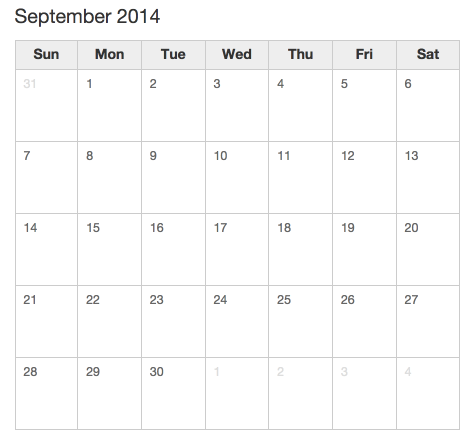
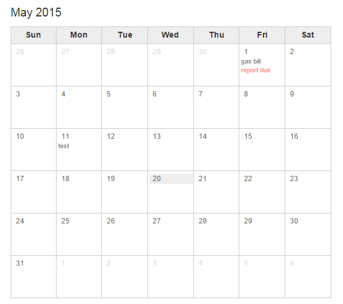

Reactlet Calendar
=================

Calendar component





Example code:
-------------
```
app.componentData = {
    year: 2014,
    month:9
};
app.component = React.render(
    <Calendar data={ app.componentData } />,
    document.getElementById('component1')
);
```
